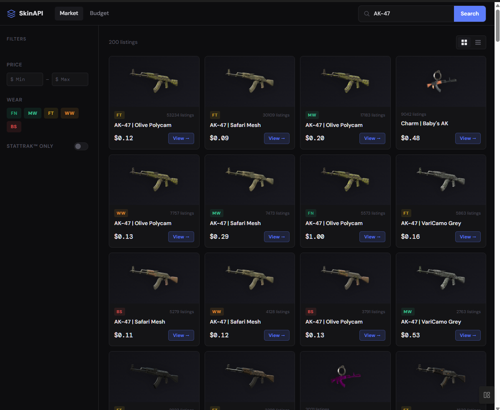

## Demo


A REST API built in C++ that provides real-time CS2 skin market data from the Steam Marketplace, with a budget optimizer powered by a 0/1 knapsack algorithm and a loadout builder with weapon-variety interleaving.

## Features

- **Skin Search** — Search CS2 skins by name with live Steam Market data, filterable by price range, wear condition, and StatTrak
- **Price Lookup** — Get current market prices, median price, and volume for any skin
- **Budget Optimizer** — Given a budget, selects the optimal combination of skins using a 0/1 knapsack dynamic programming algorithm (greedy fallback for large inputs)
- **Loadout Builder** — Pick T or CT side and set per-slot budgets; round-robin interleaving ensures weapon variety across primary, secondary, knife, and gloves

## Tech Stack

- **C++17** — Backend server and optimization logic
- **Crow** — Lightweight C++ HTTP framework (single-header)
- **libcurl** — HTTP client for Steam Market API
- **nlohmann/json** — JSON parsing and serialization
- **CMake** — Cross-platform build system
- **Vanilla JS/HTML/CSS** — Frontend with grid/list views and client-side filtering

## Endpoints

### `GET /health`
Returns server status.

### `GET /search?q={query}&min={min_usd}&max={max_usd}`
Search for CS2 skins by name with optional price range filtering.

**Example:**
```
GET /search?q=AK-47+Redline&min=10&max=100
```

**Response:**
```json
{
  "total_count": 8,
  "results": [
    {
      "name": "AK-47 | Redline (Field-Tested)",
      "hash_name": "AK-47 | Redline (Field-Tested)",
      "sell_listings": 803,
      "sell_price": 4823,
      "sell_price_text": "$48.23",
      "sale_price_text": "",
      "icon_url": "https://community.akamai.steamstatic.com/economy/image/...",
      "market_url": "https://steamcommunity.com/market/listings/730/..."
    }
  ]
}
```

### `GET /price?name={market_hash_name}`
Get price overview for a specific skin.

### `POST /budget/optimize`
Select the optimal combination of skins within a budget. Uses 0/1 knapsack DP for budgets up to $500 with up to 150 items; falls back to a greedy heuristic for larger inputs.

**Request:**
```json
{
  "budget": 100.00,
  "query": "AK-47 Redline"
}
```

**Response:**
```json
{
  "budget": 100.00,
  "total_spent": 88.17,
  "remaining": 11.83,
  "skins_found": 42,
  "skins_selected": 2,
  "algorithm": "knapsack_dp",
  "skins": [
    { "name": "AK-47 | Redline (Field-Tested)", "price": "$48.23", "price_cents": 4823, "listings": 803 },
    { "name": "AK-47 | Redline (Battle-Scarred)", "price": "$39.94", "price_cents": 3994, "listings": 64 }
  ]
}
```

### `POST /loadout/build`
Build a full loadout for T or CT side with separate budgets for weapons, knife, and gloves. Uses round-robin interleaving across weapon types to ensure variety.

**Request:**
```json
{
  "side": "T",
  "weapons_budget": 100.00,
  "knife_budget": 50.00,
  "gloves_budget": 30.00
}
```

**Response:**
```json
{
  "side": "T",
  "weapons_budget": 100.00,
  "knife_budget": 50.00,
  "gloves_budget": 30.00,
  "slots": {
    "primary": [{ "name": "AK-47 | Redline (FT)", "price": "$48.23", "price_cents": 4823, "listings": 803 }],
    "secondary": [{ "name": "Glock-18 | Fade (FN)", "price": "$42.10", "price_cents": 4210, "listings": 12 }],
    "knife": [{ "name": "★ Gut Knife | Doppler (FN)", "price": "$49.99", "price_cents": 4999, "listings": 5 }],
    "gloves": [{ "name": "★ Sport Gloves | Arid (FT)", "price": "$28.50", "price_cents": 2850, "listings": 8 }]
  }
}
```

## Building

### Prerequisites
- CMake 3.20+
- C++17 compiler (GCC, Clang, or MSVC)
- libcurl development headers
- nlohmann/json (included via Crow header)

### Build (Windows — MSYS2/MinGW)
```bash
mkdir build && cd build
cmake .. -G "MinGW Makefiles"
cmake --build .
./cs-skin-api.exe
```

### Build (Linux / macOS)
```bash
mkdir build && cd build
cmake ..
cmake --build .
./cs-skin-api
```

Server runs on `http://localhost:8080`. Open `frontend.html` in a browser to use the UI.
