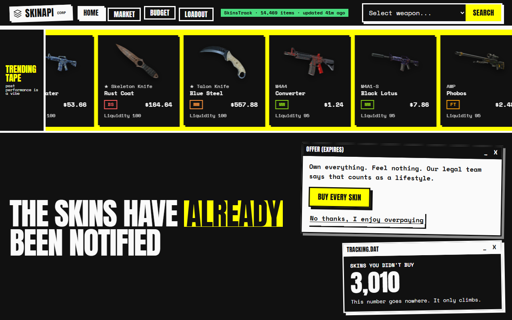
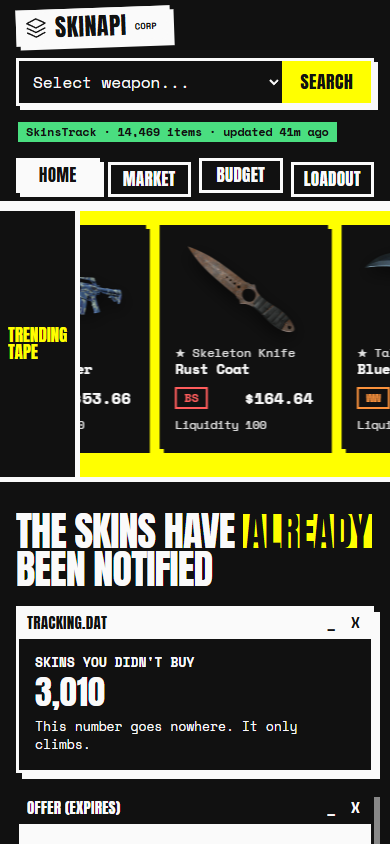
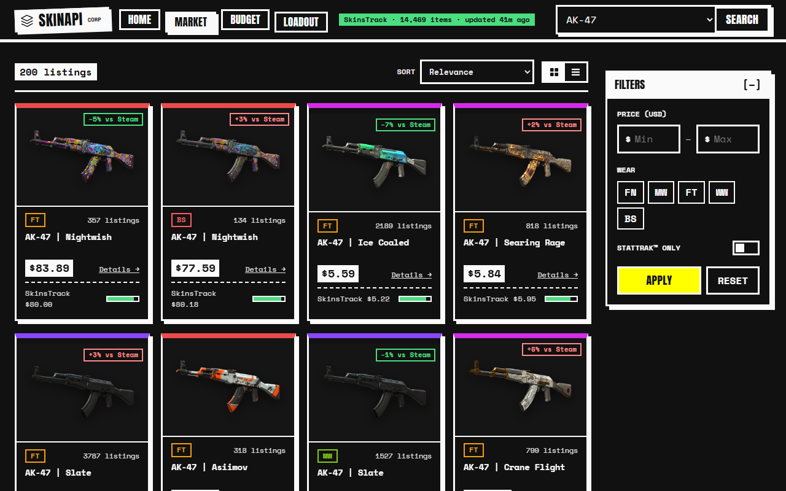
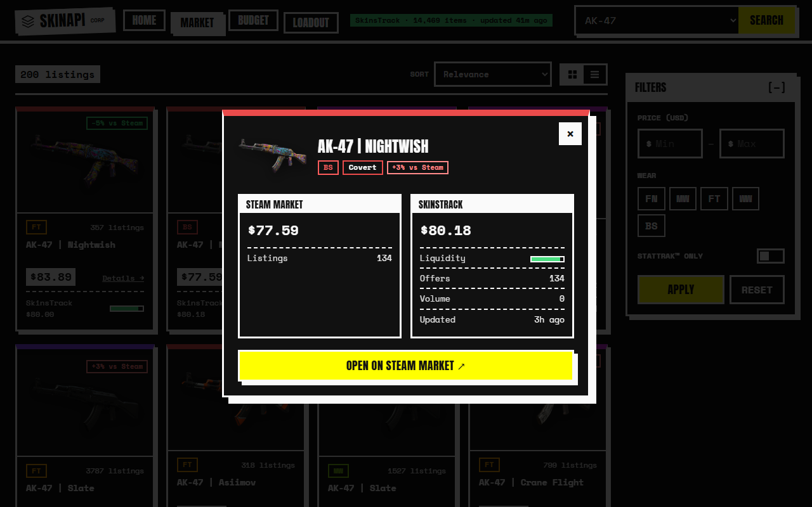
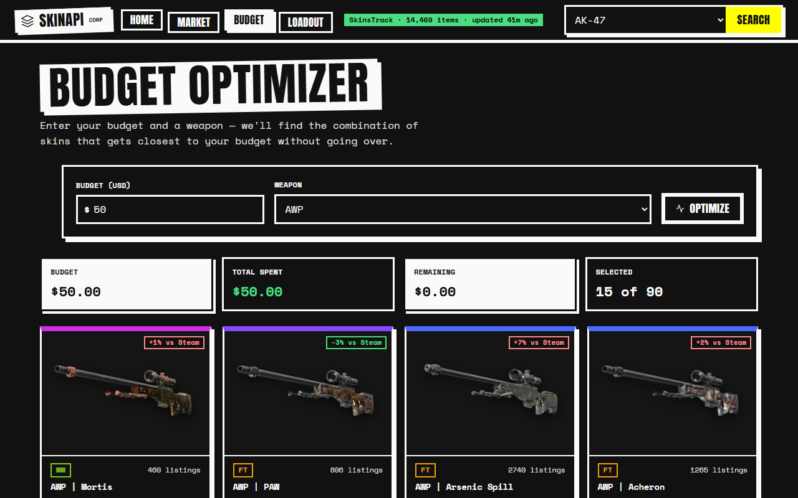
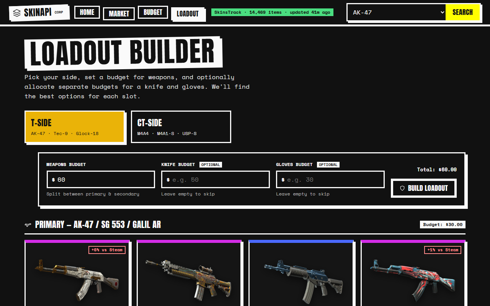

<div align="center">

# SkinAPI

**Live CS2 skin prices, a budget optimizer and a loadout builder, written in C++17**


[](https://github.com/JakeeUp/cs-skin-api/actions/workflows/ci.yml)

[Live Demo](https://jakeeup.github.io/cs-skin-api/) · [Getting Started](#getting-started) · [API Reference](#api-reference)

</div>

---

## Overview

SkinAPI is a C++17 REST API for CS2 skin prices. It pulls live data from the Steam Community Market and [SkinsTrack](https://skinstrack.com), then serves it back as JSON. You can look up trending skins, search, compare prices, spend a budget, or build a full loadout.

The frontend is a storefront for **SkinAPI Corp**, a fake company that looks like it shouldn't exist. Think safety-yellow ticker tape, condensed headlines and raw monospace. The jokes stay on the Home page, though. Market, Budget and Loadout are straight tools with real prices and real Steam links.



---

## Features

### Home: Trending Skins
The landing page has a scrolling row of the most liquid skins on the market and a grid of premium picks over $100. Both read from the cached SkinsTrack snapshot, so they don't cost any API calls. The row stops when you hover or focus it. If you've asked for reduced motion, it's just a still row you can swipe.

Home is also where the SkinAPI Corp bits live. There's a "BUY EVERY SKIN" checkout that loops forever (no input fields, collects nothing), a countdown to a pointless event sitting next to a real one for the next price refresh, a "Deal of the 10 Minutes" with a real price, and a few easter eggs.

<p align="center"></p>

### Market Search
Search by weapon name and get live Steam Market results. You can filter by price, wear (FN/MW/FT/WW/BS) and StatTrak, and switch between grid and list views.

Every card puts the Steam price next to the SkinsTrack price, with a liquidity meter and the gap between the two. Click one to see both sources side by side.





### Budget Optimizer
Give it a dollar amount and a weapon. It grabs the skins on offer and runs a **0/1 knapsack** to find the mix that gets you the most value without going over. Budgets up to $500 use dynamic programming. Anything bigger falls back to a greedy pass, which is close enough and a lot faster.



### Loadout Builder
Pick T or CT, then set separate budgets for weapons, knife and gloves. Picks are interleaved **round-robin** across weapon types. So you won't ask for a loadout and get five AK-47s back.



---

## Tech Stack

| Layer | Technology | Purpose |
|-------|-----------|---------|
| **Backend** | C++17 | Server, algorithms, API logic |
| **HTTP Framework** | [Crow](https://crowcpp.org/) | Routing, CORS, JSON responses |
| **HTTP Client** | libcurl | Steam Market API requests |
| **JSON** | [nlohmann/json](https://github.com/nlohmann/json) | Parsing and serialization |
| **Build** | CMake 3.20+ | Cross-platform builds |
| **Frontend** | Vanilla JS / HTML / CSS | UI with no framework dependencies |

---

## Architecture

```
┌─────────────┐       HTTP        ┌──────────────────────────────────┐
│   Browser    │ ◄──────────────► │         Crow HTTP Server         │
│  index.html  │                  │           port 8080              │
│   js/app.js  │                  ├──────────────────────────────────┤
└─────────────┘                   │  /search    → fetchQuery()       │
                                  │  /price     → fetchURL()         │
                                  │  /budget    → knapsackOptimize() │
                                  │  /loadout   → fetchSlotOptions() │
                                  ├──────────────────────────────────┤
                                  │         libcurl + rate limiter   │
                                  └────────────┬─────────────────────┘
                                               │ HTTPS
                                  ┌────────────▼─────────────────────┐
                                  │   Steam Community Market API     │
                                  └──────────────────────────────────┘
```

---

## Getting Started

### Prerequisites

- CMake 3.20+
- C++17 compiler (GCC, Clang, or MSVC)
- libcurl development headers
- Python 3.6+ (for running the frontend dev server)

### Configuration

Copy `.env.example` to `.env` and fill it in:

```bash
cp .env.example .env
```

The ones that matter:
- **`SKINSTRACK_API_KEY`**: your key from [skinstrack.com/api-pricing](https://skinstrack.com/api-pricing). The free plan only gives you 50 calls a month. That's why the server caches the whole price list and refreshes it no more than once every `SKINSTRACK_REFRESH_HOURS`.
- **`SKINSTRACK_REFRESH_HOURS`**: how often to refresh, in hours (default 24). At 24 you'll use about 30 of your 50 monthly calls.
- **`SKINSTRACK_CACHE_FILE`**: where the cached price list goes (default `data/skinstrack-items.json`).
- **`PORT`**: server port (default 8080).
- **`ALLOWED_ORIGIN`**: the browser origin CORS lets through. It has to match exactly where the frontend is served, like `http://127.0.0.1:5500` locally or your GitHub Pages URL.
- **`CURL_CA_BUNDLE`**: optional CA bundle for HTTPS. On MSYS2 point it at `C:/msys64/ucrt64/etc/ssl/certs/ca-bundle.crt`. Leave it empty and libcurl uses its default.

Real environment variables win over anything in `.env`.

### Build & Run

**Windows (MSYS2/MinGW), the quick way**

Run this from PowerShell. Git Bash won't work here.
```powershell
scripts\dev.bat
```

It does four things:
1. Add MSYS2 tools to PATH
2. Build the project if needed
3. Start the API on `http://127.0.0.1:8080`
4. Start the frontend dev server on `http://127.0.0.1:5500`

To stop both:
```powershell
scripts\stop.bat
```

**Windows (Manual)**
```bash
mkdir build && cd build
cmake .. -G "MinGW Makefiles"
cmake --build . -j 8
.\cs-skin-api.exe
```

Then, in a second terminal:
```bash
python -m http.server 5500
```

**Linux / macOS**
```bash
mkdir build && cd build
cmake ..
cmake --build .
./cs-skin-api
```

Then, in a second terminal:
```bash
python -m http.server 5500
```

**Note**: the frontend has to be served over HTTP. Opening it with `file://` won't work. If your API lives somewhere unusual, add `?api=http://host:port` to the page URL.

---

## API Reference

### `GET /health`

Tells you the server is up. No auth needed.

**Status Codes**: 200 (OK)

```json
{ "status": "ok", "message": "CS Skin API is alive" }
```

---

### `GET /search`

Search skins by name. You can narrow it to a price range if you want.

**Status Codes**:
- 200 (OK)
- 400 (Bad Request): query missing or exceeds 64 characters
- 500 (Internal Server Error)

| Parameter | Type | Required | Description |
|-----------|------|----------|-------------|
| `q` | string | Yes | Weapon or skin name (max 64 characters) |
| `min` | float | No | Minimum price in USD (default: 0, max 10000) |
| `max` | float | No | Maximum price in USD (default: 999999, max 10000) |

**Example:** `GET /search?q=AK-47+Redline&min=10&max=100`

<details>
<summary>Response</summary>

```json
{
  "total_count": 8,
  "results": [
    {
      "name": "AK-47 | Redline (Field-Tested)",
      "hash_name": "AK-47 | Redline (Field-Tested)",
      "sell_listings": 803,
      "sell_price": 4823,
      "sell_price_text": "$48.23",
      "sale_price_text": "",
      "icon_url": "https://community.akamai.steamstatic.com/economy/image/...",
      "market_url": "https://steamcommunity.com/market/listings/730/..."
    }
  ]
}
```
</details>

---

### `GET /price`

Price overview for one skin.

**Status Codes**:
- 200 (OK)
- 400 (Bad Request): name parameter missing
- 500 (Internal Server Error)

| Parameter | Type | Required | Description |
|-----------|------|----------|-------------|
| `name` | string | Yes | Market hash name of the skin |

**Example:** `GET /price?name=AK-47+Redline+(Field-Tested)`

<details>
<summary>Response</summary>

```json
{
  "name": "AK-47 | Redline (Field-Tested)",
  "lowest_price": "$45.00",
  "median_price": "$48.23",
  "volume": "342"
}
```
</details>

---

### `POST /budget/optimize`

Picks the best set of skins that fits your budget, using a 0/1 knapsack.

**Status Codes**:
- 200 (OK)
- 400 (Bad Request): invalid JSON, missing fields, or budget outside [0, 10000]
- 413 (Payload Too Large): request body exceeds 4 KB
- 500 (Internal Server Error)

| Field | Type | Required | Description |
|-------|------|----------|-------------|
| `budget` | float | Yes | Maximum budget in USD (0–10000) |
| `query` | string | Yes | Weapon or skin name to search (max 64 characters) |

<details>
<summary>Request / Response</summary>

**Request:**
```json
{
  "budget": 100.00,
  "query": "AK-47 Redline"
}
```

**Response:**
```json
{
  "budget": 100.00,
  "total_spent": 88.17,
  "remaining": 11.83,
  "skins_found": 42,
  "skins_selected": 2,
  "algorithm": "knapsack_dp",
  "skins": [
    { "name": "AK-47 | Redline (Field-Tested)", "price": "$48.23", "price_cents": 4823, "listings": 803 },
    { "name": "AK-47 | Redline (Battle-Scarred)", "price": "$39.94", "price_cents": 3994, "listings": 64 }
  ]
}
```
</details>

---

### `POST /loadout/build`

Builds a full T or CT loadout with a budget per slot.

**Status Codes**:
- 200 (OK)
- 400 (Bad Request): invalid JSON or invalid side
- 413 (Payload Too Large): request body exceeds 4 KB
- 500 (Internal Server Error)

| Field | Type | Required | Description |
|-------|------|----------|-------------|
| `side` | string | Yes | `"T"` or `"CT"` |
| `weapons_budget` | float | Yes | Budget split between primary and secondary (0–10000) |
| `knife_budget` | float | No | Knife budget, 0 skips the slot (0–10000) |
| `gloves_budget` | float | No | Gloves budget, 0 skips the slot (0–10000) |

<details>
<summary>Request / Response</summary>

**Request:**
```json
{
  "side": "T",
  "weapons_budget": 100.00,
  "knife_budget": 50.00,
  "gloves_budget": 30.00
}
```

**Response:**
```json
{
  "side": "T",
  "weapons_budget": 100.00,
  "knife_budget": 50.00,
  "gloves_budget": 30.00,
  "slots": {
    "primary": [{ "name": "AK-47 | Redline (FT)", "price": "$48.23", "price_cents": 4823, "listings": 803 }],
    "secondary": [{ "name": "Glock-18 | Fade (FN)", "price": "$42.10", "price_cents": 4210, "listings": 12 }],
    "knife": [{ "name": "Gut Knife | Doppler (FN)", "price": "$49.99", "price_cents": 4999, "listings": 5 }],
    "gloves": [{ "name": "Sport Gloves | Arid (FT)", "price": "$28.50", "price_cents": 2850, "listings": 8 }]
  }
}
```
</details>

---

### `GET /skinstrack/status`

Shows whether the cached SkinsTrack price list is loaded and how old it is.

**Status Codes**:
- 200 (OK)
- 503 (Service Unavailable): SkinsTrack not configured or data missing

<details>
<summary>Response</summary>

```json
{
  "status": "fresh",
  "cache_file": "data/skinstrack-items.json",
  "item_count": 5432,
  "last_updated": "2025-02-15T10:30:00Z",
  "next_refresh": "2025-02-16T10:30:00Z"
}
```
</details>

---

### `GET /skinstrack/price`

SkinsTrack price data for one skin.

**Status Codes**:
- 200 (OK)
- 400 (Bad Request): name parameter missing
- 404 (Not Found): skin not found in SkinsTrack cache
- 503 (Service Unavailable): SkinsTrack not configured

| Parameter | Type | Required | Description |
|-----------|------|----------|-------------|
| `name` | string | Yes | Market hash name of the skin (max 64 characters) |

<details>
<summary>Response</summary>

```json
{
  "name": "AK-47 | Redline (Field-Tested)",
  "price_cents": 4823,
  "liquidity": "high",
  "count": 156,
  "volume": 45230,
  "updated_at": "2025-02-15T10:30:00Z"
}
```
</details>

### `GET /skinstrack/trending`

The most liquid skins in the cached SkinsTrack snapshot. It doesn't spend any API calls. Results are ranked by liquidity, then by offer count. Stickers, charms and cases are left out, and each skin only shows up once no matter how many wear or StatTrak versions exist.

| Param | Default | Notes |
|-------|---------|-------|
| `limit` | 24 | 1–100 |
| `min` | 1 | Minimum price in USD (0–10000) |

**Status codes:** 200, 400 (bad `limit`/`min`), 503 (SkinsTrack data not loaded)

```json
{
  "count": 1,
  "items": [{
    "name": "AK-47 | Redline (Field-Tested)",
    "price_cents": 3488,
    "icon_url": "https://community.akamai.steamstatic.com/economy/image/...",
    "market_url": "https://steamcommunity.com/market/listings/730/...",
    "skinstrack": { "price_cents": 3488, "liquidity": 85, "count": 1176, "volume": 0, "updated_at": "..." }
  }]
}
```

---

## Project Structure

```
cs-skin-api/
├── src/
│   ├── main.cpp              # Crow HTTP server, route handlers
│   ├── config.cpp / .hpp     # .env parsing and configuration
│   ├── http_client.cpp / .hpp    # libcurl wrapper for API requests
│   ├── steam_market.cpp / .hpp   # Steam Community Market scraper
│   ├── optimizer.cpp / .hpp  # 0/1 knapsack algorithm
│   ├── skin.hpp              # Skin data structure
│   └── validation.cpp / .hpp # Input validation and sanitization
├── tests/
│   ├── cpp/                  # C++ unit tests
│   ├── frontend/             # JavaScript tests
│   └── fixtures/             # Test data
├── js/
│   ├── app.js                # Client-side logic and API calls
│   └── demo-data.js          # Sample data for GitHub Pages demo
├── css/
│   └── style.css             # Dark theme styling
├── index.html                # Frontend UI
├── CMakeLists.txt            # Build configuration
├── .env.example              # Configuration template
├── scripts/
│   ├── dev.bat               # Windows dev server launcher
│   └── stop.bat              # Windows dev server stopper
├── .github/
│   └── workflows/
│       └── ci.yml            # CI/CD pipeline
├── third_party/
│   └── crow_all.h            # Crow HTTP framework (single header)
└── assets/
    └── screenshots/          # README screenshots (home, mobile, market, detail, budget, loadout)
```

---

## Testing

C++ tests:
```bash
ctest --test-dir build --output-on-failure
```

Frontend tests:
```bash
node --test tests/frontend/
```

CI runs both on every push and PR to `main` and `dev`. The details are in `.github/workflows/ci.yml`.
