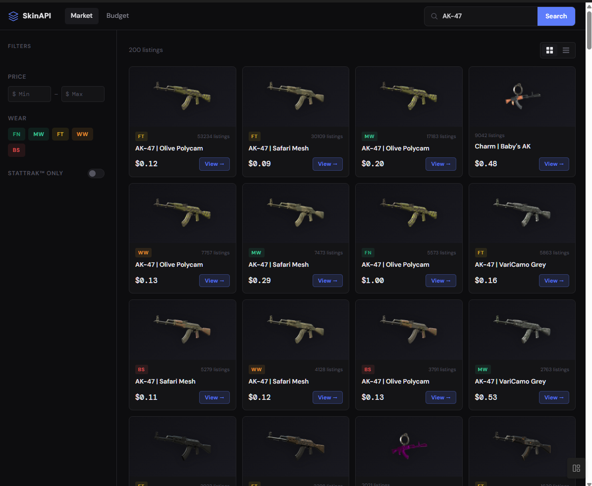

<div align="center">

# SkinAPI

**Real-time CS2 skin market data, budget optimization, and loadout building — powered by C++17**


[](https://github.com/JakeeUp/cs-skin-api/actions/workflows/ci.yml)

[Live Demo](https://jakeeup.github.io/cs-skin-api/) · [Getting Started](#getting-started) · [API Reference](#api-reference)

</div>

---

## Overview

SkinAPI is a REST API that pulls live CS2 skin pricing from the Steam Community Market and exposes search, price lookup, budget optimization, and full loadout building through a clean JSON interface. The frontend provides a responsive dark-themed UI with grid/list views and client-side filtering.

<!-- Replace with a screenshot of the full app UI -->


---

## Features

### Home: Trending Skins
The landing page shows a continuously scrolling row of the most liquid skins on the market, plus a grid of premium picks over $100. Both come from the cached SkinsTrack snapshot, so they never spend API calls. The row pauses on hover or keyboard focus and becomes a still, swipeable row for visitors who prefer reduced motion.

### Market Search
Search CS2 skins by weapon name with live Steam Market data. Filter results by price range, wear condition (FN/MW/FT/WW/BS), and StatTrak status. Toggle between grid and list views.

<!--  -->

### Budget Optimizer
Enter a dollar budget and a weapon — the optimizer fetches available skins and runs a **0/1 knapsack algorithm** to select the combination that maximizes total value without exceeding your budget. Uses dynamic programming for budgets up to $500, with a greedy fallback for larger inputs.

<!--  -->

### Loadout Builder
Pick T or CT side and set separate budgets for primary weapons, secondary weapons, knife, and gloves. A **round-robin interleaving algorithm** ensures variety across weapon types — you won't get five AK-47 skins when you wanted a diverse loadout.

<!--  -->

---

## Tech Stack

| Layer | Technology | Purpose |
|-------|-----------|---------|
| **Backend** | C++17 | Server, algorithms, API logic |
| **HTTP Framework** | [Crow](https://crowcpp.org/) | Routing, CORS, JSON responses |
| **HTTP Client** | libcurl | Steam Market API requests |
| **JSON** | [nlohmann/json](https://github.com/nlohmann/json) | Parsing and serialization |
| **Build** | CMake 3.20+ | Cross-platform builds |
| **Frontend** | Vanilla JS / HTML / CSS | UI with no framework dependencies |

---

## Architecture

```
┌─────────────┐       HTTP        ┌──────────────────────────────────┐
│   Browser    │ ◄──────────────► │         Crow HTTP Server         │
│  index.html  │                  │           port 8080              │
│   js/app.js  │                  ├──────────────────────────────────┤
└─────────────┘                   │  /search    → fetchQuery()       │
                                  │  /price     → fetchURL()         │
                                  │  /budget    → knapsackOptimize() │
                                  │  /loadout   → fetchSlotOptions() │
                                  ├──────────────────────────────────┤
                                  │         libcurl + rate limiter   │
                                  └────────────┬─────────────────────┘
                                               │ HTTPS
                                  ┌────────────▼─────────────────────┐
                                  │   Steam Community Market API     │
                                  └──────────────────────────────────┘
```

---

## Getting Started

### Prerequisites

- CMake 3.20+
- C++17 compiler (GCC, Clang, or MSVC)
- libcurl development headers
- Python 3.6+ (for running the frontend dev server)

### Configuration

Copy `.env.example` to `.env` and fill in the required values:

```bash
cp .env.example .env
```

Key variables:
- **`SKINSTRACK_API_KEY`**: SkinsTrack API key from [skinstrack.com/api-pricing](https://skinstrack.com/api-pricing). The free plan allows 50 calls/month; the server caches the full price list and refreshes at most every `SKINSTRACK_REFRESH_HOURS`.
- **`SKINSTRACK_REFRESH_HOURS`**: Refresh interval in hours (default: 24). At 24-hour intervals, the API uses ~30 of the 50 monthly calls.
- **`SKINSTRACK_CACHE_FILE`**: Where the cached price list is stored (default: `data/skinstrack-items.json`).
- **`PORT`**: Server port (default: 8080).
- **`ALLOWED_ORIGIN`**: Browser origin allowed to call the API for CORS. Set this to the exact origin where the frontend is served, e.g., `http://127.0.0.1:5500` for local development or your GitHub Pages URL.
- **`CURL_CA_BUNDLE`**: Optional CA certificate bundle for HTTPS verification. On MSYS2, use `C:/msys64/ucrt64/etc/ssl/certs/ca-bundle.crt`. Leave empty to use libcurl's default.

Real environment variables override `.env` values.

### Build & Run

**Windows (MSYS2/MinGW) — Quickstart**

Run the development script from PowerShell (not Git Bash):
```powershell
scripts\dev.bat
```

This will:
1. Add MSYS2 tools to PATH
2. Build the project if needed
3. Start the API on `http://127.0.0.1:8080`
4. Start the frontend dev server on `http://127.0.0.1:5500`

To stop both services:
```powershell
scripts\stop.bat
```

**Windows (Manual)**
```bash
mkdir build && cd build
cmake .. -G "MinGW Makefiles"
cmake --build . -j 8
.\cs-skin-api.exe
```

Then in another terminal:
```bash
python -m http.server 5500
```

**Linux / macOS**
```bash
mkdir build && cd build
cmake ..
cmake --build .
./cs-skin-api
```

Then in another terminal:
```bash
python -m http.server 5500
```

**Note**: The frontend must be served over HTTP (not `file://`). To override the API base URL for non-standard setups, append `?api=http://host:port` to the URL.

---

## API Reference

### `GET /health`

Returns server status. No authentication required.

**Status Codes**: 200 (OK)

```json
{ "status": "ok", "message": "CS Skin API is alive" }
```

---

### `GET /search`

Search for CS2 skins by name with optional price range filtering.

**Status Codes**: 
- 200 (OK)
- 400 (Bad Request) — query missing or exceeds 64 characters
- 500 (Internal Server Error)

| Parameter | Type | Required | Description |
|-----------|------|----------|-------------|
| `q` | string | Yes | Weapon or skin name (max 64 characters) |
| `min` | float | No | Minimum price in USD (default: 0, max 10000) |
| `max` | float | No | Maximum price in USD (default: 999999, max 10000) |

**Example:** `GET /search?q=AK-47+Redline&min=10&max=100`

<details>
<summary>Response</summary>

```json
{
  "total_count": 8,
  "results": [
    {
      "name": "AK-47 | Redline (Field-Tested)",
      "hash_name": "AK-47 | Redline (Field-Tested)",
      "sell_listings": 803,
      "sell_price": 4823,
      "sell_price_text": "$48.23",
      "sale_price_text": "",
      "icon_url": "https://community.akamai.steamstatic.com/economy/image/...",
      "market_url": "https://steamcommunity.com/market/listings/730/..."
    }
  ]
}
```
</details>

---

### `GET /price`

Get price overview for a specific skin.

**Status Codes**: 
- 200 (OK)
- 400 (Bad Request) — name parameter missing
- 500 (Internal Server Error)

| Parameter | Type | Required | Description |
|-----------|------|----------|-------------|
| `name` | string | Yes | Market hash name of the skin |

**Example:** `GET /price?name=AK-47+Redline+(Field-Tested)`

<details>
<summary>Response</summary>

```json
{
  "name": "AK-47 | Redline (Field-Tested)",
  "lowest_price": "$45.00",
  "median_price": "$48.23",
  "volume": "342"
}
```
</details>

---

### `POST /budget/optimize`

Select the optimal combination of skins within a budget using a 0/1 knapsack algorithm.

**Status Codes**: 
- 200 (OK)
- 400 (Bad Request) — invalid JSON, missing fields, or budget outside [0, 10000]
- 413 (Payload Too Large) — request body exceeds 4 KB
- 500 (Internal Server Error)

| Field | Type | Required | Description |
|-------|------|----------|-------------|
| `budget` | float | Yes | Maximum budget in USD (0–10000) |
| `query` | string | Yes | Weapon or skin name to search (max 64 characters) |

<details>
<summary>Request / Response</summary>

**Request:**
```json
{
  "budget": 100.00,
  "query": "AK-47 Redline"
}
```

**Response:**
```json
{
  "budget": 100.00,
  "total_spent": 88.17,
  "remaining": 11.83,
  "skins_found": 42,
  "skins_selected": 2,
  "algorithm": "knapsack_dp",
  "skins": [
    { "name": "AK-47 | Redline (Field-Tested)", "price": "$48.23", "price_cents": 4823, "listings": 803 },
    { "name": "AK-47 | Redline (Battle-Scarred)", "price": "$39.94", "price_cents": 3994, "listings": 64 }
  ]
}
```
</details>

---

### `POST /loadout/build`

Build a full loadout for T or CT side with per-slot budgets.

**Status Codes**: 
- 200 (OK)
- 400 (Bad Request) — invalid JSON or invalid side
- 413 (Payload Too Large) — request body exceeds 4 KB
- 500 (Internal Server Error)

| Field | Type | Required | Description |
|-------|------|----------|-------------|
| `side` | string | Yes | `"T"` or `"CT"` |
| `weapons_budget` | float | Yes | Budget split between primary and secondary (0–10000) |
| `knife_budget` | float | No | Budget for knife slot; 0 = skip (0–10000) |
| `gloves_budget` | float | No | Budget for gloves slot; 0 = skip (0–10000) |

<details>
<summary>Request / Response</summary>

**Request:**
```json
{
  "side": "T",
  "weapons_budget": 100.00,
  "knife_budget": 50.00,
  "gloves_budget": 30.00
}
```

**Response:**
```json
{
  "side": "T",
  "weapons_budget": 100.00,
  "knife_budget": 50.00,
  "gloves_budget": 30.00,
  "slots": {
    "primary": [{ "name": "AK-47 | Redline (FT)", "price": "$48.23", "price_cents": 4823, "listings": 803 }],
    "secondary": [{ "name": "Glock-18 | Fade (FN)", "price": "$42.10", "price_cents": 4210, "listings": 12 }],
    "knife": [{ "name": "Gut Knife | Doppler (FN)", "price": "$49.99", "price_cents": 4999, "listings": 5 }],
    "gloves": [{ "name": "Sport Gloves | Arid (FT)", "price": "$28.50", "price_cents": 2850, "listings": 8 }]
  }
}
```
</details>

---

### `GET /skinstrack/status`

Check the status and freshness of the cached SkinsTrack price list.

**Status Codes**: 
- 200 (OK)
- 503 (Service Unavailable) — SkinsTrack not configured or data missing

<details>
<summary>Response</summary>

```json
{
  "status": "fresh",
  "cache_file": "data/skinstrack-items.json",
  "item_count": 5432,
  "last_updated": "2025-02-15T10:30:00Z",
  "next_refresh": "2025-02-16T10:30:00Z"
}
```
</details>

---

### `GET /skinstrack/price`

Lookup SkinsTrack price data for a skin.

**Status Codes**: 
- 200 (OK)
- 400 (Bad Request) — name parameter missing
- 404 (Not Found) — skin not found in SkinsTrack cache
- 503 (Service Unavailable) — SkinsTrack not configured

| Parameter | Type | Required | Description |
|-----------|------|----------|-------------|
| `name` | string | Yes | Market hash name of the skin (max 64 characters) |

<details>
<summary>Response</summary>

```json
{
  "name": "AK-47 | Redline (Field-Tested)",
  "price_cents": 4823,
  "liquidity": "high",
  "count": 156,
  "volume": 45230,
  "updated_at": "2025-02-15T10:30:00Z"
}
```
</details>

### `GET /skinstrack/trending`

Most liquid skins from the cached SkinsTrack snapshot (no API calls spent). Ranked by liquidity, then offer count; stickers, charms, and cases are excluded, and only one wear/StatTrak variant per skin is kept.

| Param | Default | Notes |
|-------|---------|-------|
| `limit` | 24 | 1–100 |
| `min` | 1 | Minimum price in USD (0–10000) |

**Status codes:** 200, 400 (bad `limit`/`min`), 503 (SkinsTrack data not loaded)

```json
{
  "count": 1,
  "items": [{
    "name": "AK-47 | Redline (Field-Tested)",
    "price_cents": 3488,
    "icon_url": "https://community.akamai.steamstatic.com/economy/image/...",
    "market_url": "https://steamcommunity.com/market/listings/730/...",
    "skinstrack": { "price_cents": 3488, "liquidity": 85, "count": 1176, "volume": 0, "updated_at": "..." }
  }]
}
```

---

## Project Structure

```
cs-skin-api/
├── src/
│   ├── main.cpp              # Crow HTTP server, route handlers
│   ├── config.cpp / .hpp     # .env parsing and configuration
│   ├── http_client.cpp / .hpp    # libcurl wrapper for API requests
│   ├── steam_market.cpp / .hpp   # Steam Community Market scraper
│   ├── optimizer.cpp / .hpp  # 0/1 knapsack algorithm
│   ├── skin.hpp              # Skin data structure
│   └── validation.cpp / .hpp # Input validation and sanitization
├── tests/
│   ├── cpp/                  # C++ unit tests
│   ├── frontend/             # JavaScript tests
│   └── fixtures/             # Test data
├── js/
│   ├── app.js                # Client-side logic and API calls
│   └── demo-data.js          # Sample data for GitHub Pages demo
├── css/
│   └── style.css             # Dark theme styling
├── index.html                # Frontend UI
├── CMakeLists.txt            # Build configuration
├── .env.example              # Configuration template
├── scripts/
│   ├── dev.bat               # Windows dev server launcher
│   └── stop.bat              # Windows dev server stopper
├── .github/
│   └── workflows/
│       └── ci.yml            # CI/CD pipeline
├── third_party/
│   └── crow_all.h            # Crow HTTP framework (single header)
└── assets/                   # Screenshots and demo GIFs
    └── screenshot.png
```

---

## Testing

Run C++ tests:
```bash
ctest --test-dir build --output-on-failure
```

Run frontend tests:
```bash
node --test tests/frontend/
```

CI runs on every push and PR to `main` and `dev`. See `.github/workflows/ci.yml` for details.
